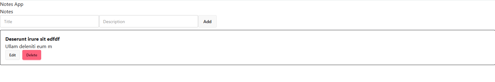

<h1 align="center">Redux Notes</h1>

- [Installation:](#installation)
- [Introduction:](#introduction)
  - [What is Redux:](#what-is-redux)
  - [What Problem Redux solves:](#what-problem-redux-solves)
  - [How Redux works:](#how-redux-works)
    - [Store:](#store)
    - [Slice:](#slice)
    - [Reducers:](#reducers)
      - [Action:](#action)
      - [Reducer Function:](#reducer-function)
    - [useSelector() and useDispatch:](#useselector-and-usedispatch)
- [Different ways to manage state in react:](#different-ways-to-manage-state-in-react)
  - [Using Props drilling:](#using-props-drilling)
    - [When to use:](#when-to-use)
    - [Problem:](#problem)
  - [Using Context API:](#using-context-api)
    - [When to use:](#when-to-use-1)
    - [Problem:](#problem-1)
  - [Using Redux:](#using-redux)
    - [When to use:](#when-to-use-2)
    - [Example 1:](#example-1)
      - [React + Redux + JS:](#react--redux--js)
      - [React + Redux + TS:](#react--redux--ts)
    - [Example 2:](#example-2)
      - [React + redux + JS:](#react--redux--js-1)
- [RTK Query:](#rtk-query)
  - [Example:](#example)

# Installation:

```bash
npm install @reduxjs/toolkit react-redux
```

# Introduction: 

## What is Redux:
Redux is a JavaScript library for predictable, centralized and maintainable state management. Means redux is a central place (store) where all of our app’s state lives, and we can update it in a predictable way. 

We use redux to our codes using Redux Toolkit (RTK). It is the official, recommended, modern way to use Redux. It Built by the Redux team to fix all the problems by using raw redux and simplifies it by reducing boilerplate and enforcing best practices.

## What Problem Redux solves:
Redux gives us a way to communicate our state from a parent to deeply nested child or another features directly without using context api and props drilling. means with redux our Project Manner can directly communicate to our intern developer without communicating project manager, Team Leader, Sr Developer, Developer, and Junior Developer. 


## How Redux works: 

### Store: 
The central place where your entire app state lives. It's Responsibility to:
- Holds state
- Runs reducers when actions are dispatched by useDespatch()

```js
// store.js
import { configureStore } from "@reduxjs/toolkit";

import likeReducer from "./likeSlice";
import userReducer from "./userSlice";
import productReducer from "./productSlice";

export const store = configureStore({
  reducer: {
    likes: likeReducer,
    user: userReducer,
    products: productReducer,
  },
});
```

### Slice: 
A Individual feature module that contains:
- state
- reducers
- actions

```js
// likeSlice.js
import { createSlice } from "@reduxjs/toolkit";

const likeSlice = createSlice({
  name: "likes",
  initialState: { value: 0 },
  reducers: {
    increment: (state) => {
      state.value += 1;
    },
    decrement: (state) => {
      state.value -= 1;
    },
  },
});

export const { increment, decrement } = likeSlice.actions;
export default likeSlice.reducer;
```

```js
import { createSlice } from "@reduxjs/toolkit";

const userSlice = createSlice({
  name: "user",
  initialState: { name: "" },
  reducers: {
    setUser: (state, action) => {
      state.name = action.payload;
    },
    removeUser: (state, action) => {
        state.name = ""
    }
  },
});

export const { setUser, removeUser } = userSlice.actions;
export default userSlice.reducer;
```

```js
import { createSlice } from "@reduxjs/toolkit";

const productSlice = createSlice({
  name: "products",
  initialState: { items: [] },
  reducers: {
    addProduct: (state, action) => {
      state.items.push(action.payload);
    },
  },
});

export const { addProduct } = productSlice.actions;
export default productSlice.reducer;
```


### Reducers: 
A object that holds all actions for a individual slice. Inside it, 
- Keys = action names
- Values = reducer functions

```js
reducers: {
  increment: (state) => { state.value++ },
  decrement: (state) => { state.value-- }
}
```

#### Action:
A object that take reducer function. 

Below are all actions: 
```js
increment: (state) => { state.value++ },
```

```js
increment: (state) => {
    state.value += 1;
},
```

```js
setUser: (state, action) => {
    state.name = action.payload;
},
```

```js
addProduct: (state, action) => {
    state.items.push(action.payload);
},
```

#### Reducer Function: 
A function that updates state based on action. It have two parameter: 
- state → current data
- action → what happened

Syntax:
```js
(state, action) => newState
```

```js
(state) => { state.value++ }
```

```js
(state) => {
    state.value += 1;
}
```

```js
(state, action) => {
    state.items.push(action.payload);
}
```

### useSelector() and useDispatch: 

- useSelector(): Reads data from the store
- useDispatch(): Sends actions to the store

```js
import { useDispatch, useSelector } from "react-redux";
import { decrement, increment, reset } from "./likeSlice";

export default function Child() {
    const likes = useSelector((state) => state.likes.value);
    const dispatch = useDispatch();
    return (
        <div>
            <h2>Likes: {likes}</h2>
            <button className="btn" onClick={() => dispatch(increment())}>Like</button>
            <button className="btn" onClick={() => dispatch(decrement())}>Dislike</button>
            <button className="btn" onClick={() => dispatch(reset())}>Reset</button>
        </div>
    );
}
```

# Different ways to manage state in react: 


## Using Props drilling: 

### When to use:
- Small apps
- if state is LOCAL and mostly used by 1–3 levels deep only
### Problem: 
- Becomes messy when deeply nested
- we also need to drilling the props for all components to get the child even intermediate components don’t need it


```js
// src/main.jsx

import { StrictMode } from 'react'
import { createRoot } from 'react-dom/client';
import './index.css'
import { createBrowserRouter, RouterProvider } from 'react-router';
import App from './App';


const router = createBrowserRouter([
  {
    path: '/',
    Component: App,
  },
])

createRoot(document.getElementById('root')).render(
  <StrictMode>
    <RouterProvider router={router}></RouterProvider>
  </StrictMode>,
)
```

```js
// src/App.jsx

import React, { useState } from "react";
import Parent from "./Parent";

export default function App() {
  const [likes, setLikes] = useState(0);

  return (
    <Parent likes={likes} setLikes={setLikes} />
  );
}
```

```js
// src/Parent.jsx

import Child from "./Child";

export default function Parent({ likes, setLikes }) {
    return (
        <Child likes={likes} setLikes={setLikes} />
    );
}
```

```js
// src/Child.jsx

export default function Child({ likes, setLikes }) {
    return (
        <div>
            <h2>Likes: {likes}</h2>
            <button className="btn" onClick={() => setLikes(likes + 1)}>Like</button>
            <button className="btn" onClick={() => setLikes(likes - 1)}>Dislike</button>
            <button className="btn" onClick={() => setLikes(0)}>Reset</button>
        </div>
    );
}
```


## Using Context API: 

### When to use:
- Want to Avoid props drilling
- Manage Simple Global state (theme, auth, etc.)

### Problem:
- Can cause unnecessary re-renders
- Not great for complex logic


```js
// src/Context.jsx

import { createContext } from "react";

export const LikeContext = createContext();
```

```js
// src/LikeContextProvider.jsx

import { useState } from "react";
import { LikeContext } from "./Context";


export default function LikeContextProvider({ children }) {
    const [likes, setLikes] = useState(0);

    return (
        <LikeContext.Provider value={{ likes, setLikes }}>
            {children}
        </LikeContext.Provider>
    );
}
```

```js
// src/main.jsx

import { StrictMode } from 'react'
import { createRoot } from 'react-dom/client';
import './index.css'
import { createBrowserRouter, RouterProvider } from 'react-router';
import App from './App';
import LikeContextProvider from './LikeContextProvider';


const router = createBrowserRouter([
  {
    path: '/',
    Component: App,
  },
])

createRoot(document.getElementById('root')).render(
  <StrictMode>
    <LikeContextProvider>
      <RouterProvider router={router}></RouterProvider>
    </LikeContextProvider>
  </StrictMode>,
)
```

```js
// src/App.jsx

import React from "react";
import Parent from "./Parent";

export default function App() {

  return (
    <Parent />
  );
}
```

```js
// src/Parent.jsx

import Child from "./Child";

export default function Parent() {
    return (
        <Child />
    );
}
```

```js
// src/Child.jsx

import { useContext } from "react";
import { LikeContext } from "./Context";

export default function Child() {
    const { likes, setLikes } = useContext(LikeContext)
    return (
        <div>
            <h2>Likes: {likes}</h2>
            <button className="btn" onClick={() => setLikes(likes + 1)}>Like</button>
            <button className="btn" onClick={() => setLikes(likes - 1)}>Dislike</button>
            <button className="btn" onClick={() => setLikes(0)}>Reset</button>
        </div>
    );
}
```

## Using Redux:

### When to use:
- Want to Avoid props drilling
- Manage Complex Global state that needs to implement on multiple features

### Example 1: 

#### React + Redux + JS: 

```js
// src/likeSlice.js

import { createSlice } from "@reduxjs/toolkit";

export const likeSlice = createSlice({
    name: "likes",
    initialState: { value: 0 },
    reducers: {
        increment: (state) => {
            state.value += 1;
        },
        decrement: (state) => {
            state.value -= 1;
        },
        reset: (state) => {
            state.value = 0;
        },
    },
});

export const { increment, decrement, reset } = likeSlice.actions;
export default likeSlice.reducer;
```

```js
// src/stores.js

import { configureStore } from "@reduxjs/toolkit";
import likeReducer from "./likeSlice";
// or
// import likeSlice from "./likeSlice"

export const store = configureStore({
    reducer: {
        likes: likeReducer,
        // likes: likeSlice
    },
});
```


```js
// src/main.jsx

import { StrictMode } from 'react'
import { createRoot } from 'react-dom/client';
import './index.css'
import { createBrowserRouter, RouterProvider } from 'react-router';
import App from './App';
import { store } from './store';
import { Provider } from 'react-redux';


const router = createBrowserRouter([
  {
    path: '/',
    Component: App,
  },
])

createRoot(document.getElementById('root')).render(
  <StrictMode>
    <Provider store={store}>
      <RouterProvider router={router}></RouterProvider>
    </Provider>
  </StrictMode>,
)
```

```js
// src/App.jsx

import React from "react";
import Parent from "./Parent";

export default function App() {

  return (
    <Parent />
  );
}
```

```js
// src/Parent.jsx

import Child from "./Child";

export default function Parent() {
    return (
        <Child />
    );
}
```

```js
// src/Child.jsx

import { useDispatch, useSelector } from "react-redux";
import { decrement, increment, reset } from "./likeSlice";

export default function Child() {
    const likes = useSelector((state) => state.likes.value);
    const dispatch = useDispatch();
    return (
        <div>
            <h2>Likes: {likes}</h2>
            <button className="btn" onClick={() => dispatch(increment())}>Like</button>
            <button className="btn" onClick={() => dispatch(decrement())}>Dislike</button>
            <button className="btn" onClick={() => dispatch(reset())}>Reset</button>
        </div>
    );
}
```


#### React + Redux + TS: 

```ts
// src/likeSlice.js

import { createSlice } from "@reduxjs/toolkit";
import type { PayloadAction } from '@reduxjs/toolkit'

// Define a type for the slice state
interface CounterState {
    value: number
}

// Define the initial state using that type
const initialState: CounterState = {
    value: 0,
}

export const likeSlice = createSlice({
    name: "likes",
    initialState,
    reducers: {
        increment: (state) => {
            state.value += 1;
        },
        decrement: (state) => {
            state.value -= 1;
        },
        reset: (state) => {
            state.value = 0;
        },
        // Use the PayloadAction type to declare the contents of `action.payload`
        incrementByAmount: (state, action: PayloadAction<number>) => {
            state.value += action.payload
        },
    },
});

export const { increment, decrement, reset, incrementByAmount } = likeSlice.actions;
export default likeSlice.reducer;
```

```ts
// src/store.ts

import { configureStore } from "@reduxjs/toolkit";
import likeReducer from "./likeSlice";

export const store = configureStore({
    reducer: {
        likes: likeReducer,
    },
});


// Infer the `RootState` and `AppDispatch` types from the store itself
export type RootState = ReturnType<typeof store.getState>
// Inferred type: {posts: PostsState, comments: CommentsState, users: UsersState}
export type AppDispatch = typeof store.dispatch
```

```ts
// src/hooks.ts

import { useDispatch, useSelector } from 'react-redux'
import type { RootState, AppDispatch } from './store'

// Use throughout your app instead of plain `useDispatch` and `useSelector`
export const useAppDispatch = useDispatch.withTypes<AppDispatch>()
export const useAppSelector = useSelector.withTypes<RootState>()
```

```ts
// src/main.tsx

import { StrictMode } from "react";
import { createRoot } from "react-dom/client";
import "./index.css";
import { createBrowserRouter, RouterProvider } from "react-router";
import App from "./App";
import { store } from "./store";
import { Provider } from "react-redux";

const router = createBrowserRouter([
  {
    path: "/",
    Component: App,
  },
]);

createRoot(document.getElementById("root")!).render(
  <StrictMode>
    <Provider store={store}>
      <RouterProvider router={router} />
    </Provider>
  </StrictMode>
);
```

```ts
// src/App.tsx

import Parent from "./Parent";

export default function App() {
  return <Parent />;
}
```

```ts
// src/Parent.tsx

import Child from "./Child";

export default function Parent() {
    return <Child />;
}
```

```js
// src/Child.ts

import { increment, decrement, reset } from "./likeSlice";
import { useAppDispatch, useAppSelector } from "./hooks";

export default function Child() {
    const likes = useAppSelector((state) => state.likes.value);
    const dispatch = useAppDispatch();

    return (
        <div>
            <h2>Likes: {likes}</h2>

            <button className="btn" onClick={() => dispatch(increment())}>
                Like
            </button>

            <button className="btn" onClick={() => dispatch(decrement())}>
                Dislike
            </button>

            <button className="btn" onClick={() => dispatch(reset())}>
                Reset
            </button>
        </div>
    );
}
```

### Example 2: 

#### React + redux + JS:

```js
// src/todoSlice.js

import { createSlice } from "@reduxjs/toolkit";

export const todoSlice = createSlice({
    name: "todos",
    initialState: { value: [] },
    reducers: {
        addTodo: (state, action) => {
            state.value.push(action.payload);
        },
        deleteTodo: (state, action) => {
            state.value = state.value.filter((todo, index) => index !== action.payload);
        },
        clearTodos: (state) => {
            state.value = [];
        },
    },
});

export const { addTodo, deleteTodo, clearTodos } = todoSlice.actions;
export default todoSlice.reducer;
```


```js
// src/stores.js

import { configureStore } from "@reduxjs/toolkit";
// import likeReducer from "./likeSlice";
import todoReducer from "./todoSlice"

export const store = configureStore({
    reducer: {
        // likes: likeReducer,
        todos: todoReducer
    },
});
```

```js
// src/main.jsx

import { StrictMode } from 'react'
import { createRoot } from 'react-dom/client';
import './index.css'
import { createBrowserRouter, RouterProvider } from 'react-router';
import App from './App';
import { store } from './store';
import { Provider } from 'react-redux';


const router = createBrowserRouter([
  {
    path: '/',
    Component: App,
  },
])

createRoot(document.getElementById('root')).render(
  <StrictMode>
    <Provider store={store}>
      <RouterProvider router={router}></RouterProvider>
    </Provider>
  </StrictMode>,
)
```

```js
// src/App.jsx

import React from "react";
import Parent from "./Parent";

export default function App() {

  return (
    <Parent />
  );
}
```

```js
// src/Parent.jsx

import Child from "./Child";

export default function Parent() {
    return (
        <Child />
    );
}
```

```js
// src/Child.jsx

import { useDispatch, useSelector } from "react-redux";
import { addTodo, deleteTodo, clearTodos } from "./todoSlice";
import { useState } from "react";

export default function Child() {
    const [text, setText] = useState("");
    const todos = useSelector((state) => state.todos.value);
    const dispatch = useDispatch();

    return (
        <div>
            <h2>Todo List</h2>

            <input className="input" value={text} onChange={(e) => setText(e.target.value)} />

            <button className="btn" onClick={() => {
                if (!text) return;
                dispatch(addTodo(text));
                setText("");
            }}>Add</button>

            <button className="btn" onClick={() => dispatch(clearTodos())}>
                Clear All
            </button>

            <ul>
                {todos.map((todo, index) => (
                    <li key={index}>
                        {todo}
                        <button className="btn" onClick={() => dispatch(deleteTodo(index))}>❌</button>
                    </li>
                ))}
            </ul>
        </div>
    );
}
```


# RTK Query: 
RTK Query is a tool from Redux Toolkit that:
- Fetches data
- Caches it
- Handles loading/error
- Auto re-fetches

We can think of it like: 
- Redux Toolkit → manages client state
- RTK Query → manages server state (API)


## Example: 

```js
// src/stores.js

import { configureStore } from "@reduxjs/toolkit";
import { notesApi } from "./api/notesApi";

export const store = configureStore({
    reducer: {
        [notesApi.reducerPath]: notesApi.reducer,
    },
    middleware: (getDefaultMiddleware) =>
        getDefaultMiddleware().concat(notesApi.middleware),
});
```

```js
// src/api/notesApi.js

import { createApi, fetchBaseQuery } from "@reduxjs/toolkit/query/react";

export const notesApi = createApi({
    reducerPath: "notesApi",

    baseQuery: fetchBaseQuery({
        baseUrl: "http://localhost:3000", // your server
    }),

    tagTypes: ["Notes"],

    endpoints: (builder) => ({
        // ✅ GET ALL NOTES
        getNotes: builder.query({
            query: () => "/notes",
            providesTags: ["Notes"],
        }),

        // ✅ GET SINGLE NOTE
        getNote: builder.query({
            query: (id) => `/notes/${id}`,
            providesTags: (result, error, id) => [{ type: "Notes", id }],
        }),

        // ✅ CREATE NOTE
        addNote: builder.mutation({
            query: (note) => ({
                url: "/notes",
                method: "POST",
                body: note,
            }),
            invalidatesTags: ["Notes"],
        }),

        // ✅ UPDATE NOTE
        updateNote: builder.mutation({
            query: ({ id, data }) => ({
                url: `/notes/${id}`,
                method: "PATCH",
                body: data,
            }),
            invalidatesTags: (result, error, { id }) => [
                { type: "Notes", id },
                "Notes",
            ],
        }),

        // ✅ DELETE NOTE
        deleteNote: builder.mutation({
            query: (id) => ({
                url: `/notes/${id}`,
                method: "DELETE",
            }),
            invalidatesTags: ["Notes"],
        }),
    }),
});

export const {
    useGetNotesQuery,
    useGetNoteQuery,
    useAddNoteMutation,
    useUpdateNoteMutation,
    useDeleteNoteMutation,
} = notesApi;
```

```js
// src/main.jsx

import { StrictMode } from 'react'
import { createRoot } from 'react-dom/client';
import './index.css'
import { createBrowserRouter, RouterProvider } from 'react-router';
import App from './App';
import { store } from './store';
import { Provider } from 'react-redux';


const router = createBrowserRouter([
  {
    path: '/',
    Component: App,
  },
])

createRoot(document.getElementById('root')).render(
  <StrictMode>
    <Provider store={store}>
      <RouterProvider router={router}></RouterProvider>
    </Provider>
  </StrictMode>,
)
```

```js 
// src/App.jsx

import Notes from "./Notes";


export default function App() {
  return (
    <div>
      <h1>Notes App</h1>
      <Notes />
    </div>
  );
}
```

```js
// src/notes.jsx

import AddNote from "./AddNote";
import { useGetNotesQuery } from "./api/notesApi";
import NoteItem from "./NoteItem";


export default function Notes() {
    const { data: notes, isLoading, error } = useGetNotesQuery();

    if (isLoading) return <p>Loading...</p>;
    if (error) return <p>Error loading notes</p>;

    return (
        <div>
            <h2>Notes</h2>

            <AddNote />

            {notes.map((note) => (
                <NoteItem key={note._id} note={note} />
            ))}
        </div>
    );
}
```

```js
// src/NoteItem.jsx

import { useState } from "react";
import {
    useDeleteNoteMutation,
    useUpdateNoteMutation,
} from "./api/notesApi";

export default function NoteItem({ note }) {
    const [deleteNote, { isLoading: isDeleting }] = useDeleteNoteMutation();
    const [updateNote, { isLoading: isUpdating }] = useUpdateNoteMutation();

    const [isOpen, setIsOpen] = useState(false);

    // local state for editing
    const [name, setName] = useState(note.name);
    const [description, setDescription] = useState(note.description);

    const handleDelete = async () => {
        await deleteNote(note._id);
    };

    const handleUpdate = async (e) => {
        e.preventDefault();

        await updateNote({
            id: note._id,
            data: { name, description },
        });

        setIsOpen(false); // close modal after update
    };

    return (
        <div className="border p-4 my-2 rounded">
            <h4 className="font-bold">{note.name}</h4>
            <p>{note.description}</p>

            <button className="btn btn-sm mr-2" onClick={() => setIsOpen(true)}>Edit</button>

            <button className="btn btn-sm btn-error" onClick={handleDelete} disabled={isDeleting}>Delete</button>

            {/* ✅ DaisyUI Modal */}
            {isOpen && (
                <dialog className="modal modal-open">
                    <div className="modal-box">
                        <h3 className="font-bold text-lg mb-4">Update Note</h3>

                        <form onSubmit={handleUpdate} className="space-y-3">
                            <input className="input input-bordered w-full" value={name}
                                onChange={(e) => setName(e.target.value)}
                                placeholder="Title" />

                            <textarea className="textarea textarea-bordered w-full" value={description}
                                onChange={(e) => setDescription(e.target.value)}
                                placeholder="Description"
                            />

                            <div className="modal-action">
                                <button type="button" className="btn" onClick={() => setIsOpen(false)} >Cancel </button>

                                <button type="submit" className="btn btn-primary" disabled={isUpdating}>
                                    {isUpdating ? "Updating..." : "Save"}
                                </button>
                            </div>
                        </form>
                    </div>
                </dialog>
            )}
        </div>
    );
}
```

```js
// src/AddNote.jsx

import { useState } from "react";
import { useAddNoteMutation } from "./api/notesApi";

export default function AddNote() {
    const [name, setName] = useState("");
    const [description, setDescription] = useState("");

    const [addNote, { isLoading }] = useAddNoteMutation();

    const handleSubmit = async (e) => {
        e.preventDefault();

        if (!name || !description) return;

        await addNote({ name, description });

        setName("");
        setDescription("");
    };

    return (
        <form onSubmit={handleSubmit}>
            <input className="input" value={name} onChange={(e) => setName(e.target.value)} placeholder="Title" />
            <input className="input" value={description} onChange={(e) => setDescription(e.target.value)} placeholder="Description" />

            <button className="btn" disabled={isLoading}>Add</button>
        </form>
    );
}
```

